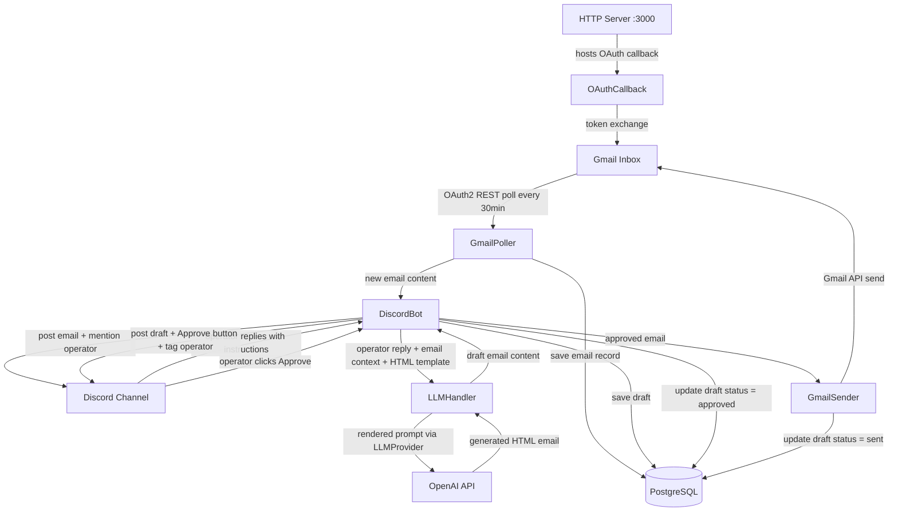
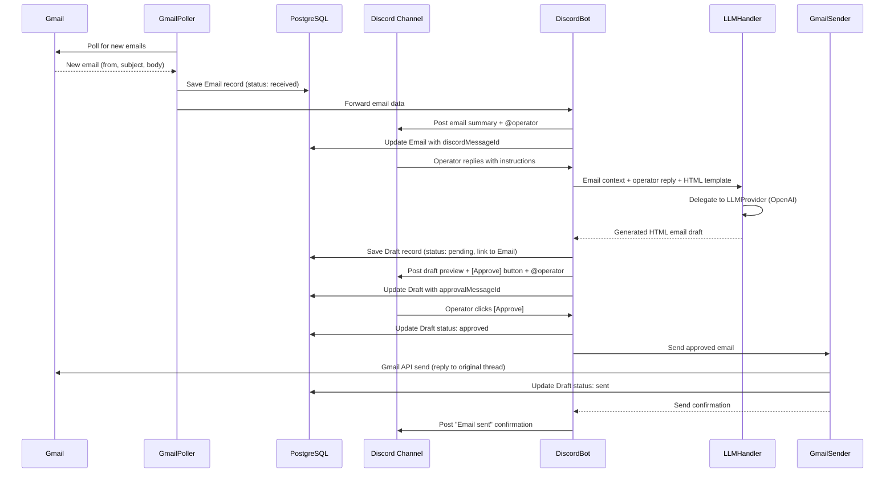

# System Design & Architecture — email-discord-bot

## Architecture Overview



**Key components**:
- `GmailPoller` — scheduled job (setInterval 30 min), calls Gmail API `users.messages.list` + `users.messages.get`, deduplicates via `Email` table in PostgreSQL
- `GmailSender` — sends approved email replies via Gmail API `users.messages.send`, constructs MIME message with HTML body
- `DiscordBot` — discord.js v14 client with minimal intents (`Guilds`, `GuildMessages`, `MessageContent`); posts email notifications, listens for reply messages via `message.reference`, handles button interactions
- `LLMHandler` — loads the HTML template file (`templates/email-reply.html`), interpolates placeholders with email context + operator instructions, delegates to an `LLMProvider` interface for generation. Current provider: **OpenAI**
- `ApprovalHandler` — handles Discord button `interactionCreate` events; on Approve click, triggers `GmailSender`
- `HTTPServer` — Bun's built-in `Bun.serve()` HTTP server; hosts the Gmail OAuth2 callback route (`/oauth/callback`)
- `Database` — PostgreSQL accessed via Prisma ORM v7; stores emails, drafts, approvals, and polling state

## Flow Sequence



## Data Models

### Prisma Schema

```prisma
datasource db {
  provider = "postgresql"
}

generator client {
  provider = "prisma-client"
  output   = "../generated"
}

model PollingState {
  id            String   @id @default("singleton")
  lastHistoryId String
  updatedAt     DateTime @updatedAt
}

model Email {
  id               String   @id @default(cuid())
  gmailMessageId   String   @unique
  gmailThreadId    String
  from             String
  replyTo          String?
  subject          String
  body             String
  receivedAt       DateTime
  discordMessageId String?  @unique
  createdAt        DateTime @default(now())
  drafts           Draft[]
}

model Draft {
  id                 String      @id @default(cuid())
  emailId            String
  email              Email       @relation(fields: [emailId], references: [id])
  operatorReply      String      // operator's Discord reply text
  generatedHtml      String      // LLM-generated HTML email body
  status             DraftStatus @default(PENDING)
  approvalMessageId  String?     @unique // Discord message with Approve button
  sentAt             DateTime?
  createdAt          DateTime    @default(now())
  updatedAt          DateTime    @updatedAt
}

enum DraftStatus {
  PENDING      // awaiting operator approval
  APPROVED     // operator clicked Approve
  SENT         // email successfully sent via Gmail
  FAILED       // Gmail send failed
  SUPERSEDED   // replaced by a newer draft for the same email
}
```

### LLM Provider Interface

```typescript
// src/llm/types.ts
interface LLMProvider {
  /** Generate an email body from a rendered prompt string */
  generate(prompt: string): Promise<string>;
}

// src/llm/providers/openai.ts
class OpenAIProvider implements LLMProvider {
  constructor(private apiKey: string, private model: string) {}
  async generate(prompt: string): Promise<string> { /* OpenAI chat completions */ }
}

// src/llm/factory.ts
function createLLMProvider(provider: string): LLMProvider {
  switch (provider) {
    case 'openai': return new OpenAIProvider(/* ... */);
    // future: case 'anthropic': return new AnthropicProvider(/* ... */);
    default: throw new Error(`Unknown LLM provider: ${provider}`);
  }
}
```

## API Design

### External APIs consumed

| API | Purpose | Auth |
|-----|---------|------|
| Gmail API `users.messages.list` | List new messages since last historyId | OAuth2 (offline refresh token) |
| Gmail API `users.messages.get` | Fetch full message payload | OAuth2 |
| Gmail API `users.messages.send` | Send approved reply email | OAuth2 |
| Discord Gateway (discord.js) | Send messages, receive reply events, handle button interactions | Bot token |
| OpenAI Chat Completions API | Generate HTML email draft from template (via `LLMProvider` abstraction) | API key (`OPENAI_API_KEY`) |

### HTTP server routes

| Method | Path | Purpose |
|--------|------|---------|
| GET | `/oauth/callback` | Receives Gmail OAuth2 authorization code, exchanges for tokens |
| GET | `/health` | Health check endpoint (includes DB connectivity check) |

## Component Breakdown

```
prisma/
  schema.prisma       # Prisma schema (Email, Draft, PollingState models)
  config.ts           # Prisma config with DATABASE_URL
  migrations/         # Prisma migration files
generated/            # Prisma generated client (gitignored)
src/
  index.ts            # Entry point: starts HTTP server + Discord bot + Gmail poller + DB connection
  db.ts               # Prisma client instantiation with pg adapter
  gmail/
    auth.ts           # OAuth2 client setup, token refresh
    poller.ts         # setInterval polling logic, historyId from DB
    parser.ts         # Extract subject, from, body from Gmail message payload
    sender.ts         # Construct MIME message + send via Gmail API
  discord/
    bot.ts            # discord.js v14 client init, event handlers
    notifier.ts       # Format and post email notification, mention operator
    replyHandler.ts   # Detect replies to bot messages, dispatch to LLM
    approvalHandler.ts # Handle Approve button click, dispatch to GmailSender
  llm/
    types.ts          # LLMProvider interface definition
    handler.ts        # Build prompt from template + reply, delegate to LLMProvider
    template.ts       # Load and interpolate HTML reply template file
    factory.ts        # Provider factory: creates LLMProvider based on LLM_PROVIDER env var
    providers/
      openai.ts       # OpenAI implementation of LLMProvider (current default)
  templates/
    email-reply.html  # HTML template with placeholders ({{subject}}, {{from}}, {{body}}, {{userReply}})
  server/
    httpServer.ts     # Bun.serve() HTTP server, routes
  config.ts           # Load + validate all env vars (including DATABASE_URL)
```

## Design Decisions

| Decision | Choice | Rationale |
|----------|--------|-----------|
| Gmail polling vs. Pub/Sub | Polling every 30 min | Simpler setup; no public webhook endpoint required; 30 min latency is acceptable |
| Outbound email | Gmail API `users.messages.send` | Same OAuth2 credentials used for reading; no additional SMTP setup needed |
| Approval mechanism | Discord Button component (`ButtonStyle.Success`) | Native Discord UX; no need for reaction-based or text-based confirmation; prevents accidental sends |
| State persistence | PostgreSQL via Prisma ORM v7 | Reliable, queryable, survives restarts; supports business logic (draft status, history); replaces fragile `state.json` |
| ORM | Prisma ORM v7 with `@prisma/adapter-pg` driver adapter | Type-safe queries, auto-generated client, migration management; v7 requires driver adapter pattern; CLI via `bunx --bun prisma` |
| Reply detection | Discord `messageCreate` event checking `message.reference` | Identifies replies to specific bot messages without requiring slash commands |
| LLM template | HTML file (`templates/email-reply.html`) with `{{placeholder}}` syntax | Easier to edit and version-control than inline config; supports rich email formatting |
| Discord.js intents | Minimal: `Guilds`, `GuildMessages`, `MessageContent` (privileged) | Follow discord.js v14 best practice — only enable what's needed; `MessageContent` required to read reply text |
| Slash command deploy | Separate deploy script (not on every startup) | Avoids rate limits; global commands take up to 1h to propagate |
| LLM abstraction | `LLMProvider` interface with provider factory | Allows swapping LLM providers (OpenAI, Anthropic, etc.) without changing business logic |
| LLM provider (current) | OpenAI (via `openai` SDK) | Selected for this phase; switchable via `LLM_PROVIDER` env var |
| Runtime | Bun | Native TypeScript execution (no build step); fast startup; built-in HTTP server, test runner, and package manager |
| HTTP framework | `Bun.serve()` built-in | Zero-dependency HTTP server; only 2 routes needed |

## Non-Functional Requirements

- **Polling interval**: 30 minutes (configurable via `POLL_INTERVAL_MS` env var)
- **LLM response time**: target < 10s for OpenAI API call
- **Email send time**: target < 5s after Approve click
- **Error handling**: Gmail poll errors → log + retry next cycle; Discord send errors → log; LLM errors → post error message in Discord channel; Gmail send errors → update Draft status to `FAILED` + post error in Discord
- **Security**: All tokens in env vars; `DATABASE_URL` in env vars; no user data logged beyond subject/from; approval required before any email is sent
- **Reliability**: Service runs as a long-lived Bun process; no crash loop — wrap poller and Discord handlers in try/catch; DB connection pool managed by Prisma
- **Recovery**: On startup, load pending drafts and unprocessed emails from DB to restore in-memory Discord message maps
