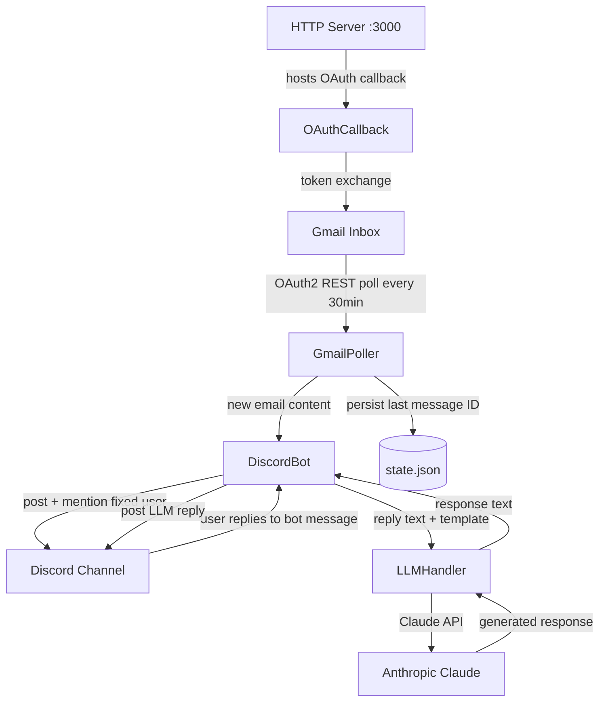

# System Design & Architecture — email-discord-bot

## Architecture Overview



**Key components**:
- `GmailPoller` — scheduled job (setInterval 30 min), calls Gmail API `users.messages.list` + `users.messages.get`, deduplicates via persisted message IDs
- `DiscordBot` — discord.js client; posts email notifications, listens for reply messages that reference bot posts
- `LLMHandler` — calls Anthropic Claude with a user-defined template + the Discord reply text
- `HTTPServer` — minimal Node.js HTTP server; hosts the Gmail OAuth2 callback route (`/oauth/callback`)
- `StateFile` — `state.json` on disk; stores last-processed Gmail `historyId` or message ID list to avoid re-processing

## Data Models

```typescript
// Persisted state
interface AppState {
  lastHistoryId: string;          // Gmail historyId for incremental polling
  processedMessageIds: string[];  // fallback deduplification list
}

// In-memory: maps Discord messageId → email context
interface PendingEmail {
  discordMessageId: string;  // bot's posted message in Discord
  gmailMessageId: string;
  subject: string;
  from: string;
  body: string;
  receivedAt: string;        // ISO timestamp
}
```

## API Design

### External APIs consumed

| API | Purpose | Auth |
|-----|---------|------|
| Gmail API `users.messages.list` | List new messages since last historyId | OAuth2 (offline refresh token) |
| Gmail API `users.messages.get` | Fetch full message payload | OAuth2 |
| Discord Gateway (discord.js) | Send messages, receive reply events | Bot token |
| Anthropic Messages API | Generate LLM reply from template | API key |

### HTTP server routes

| Method | Path | Purpose |
|--------|------|---------|
| GET | `/oauth/callback` | Receives Gmail OAuth2 authorization code, exchanges for tokens |
| GET | `/health` | Health check endpoint |

## Component Breakdown

```
src/
  index.ts            # Entry point: starts HTTP server + Discord bot + Gmail poller
  gmail/
    auth.ts           # OAuth2 client setup, token refresh
    poller.ts         # setInterval polling logic, historyId management
    parser.ts         # Extract subject, from, body from Gmail message payload
  discord/
    bot.ts            # discord.js client init, event handlers
    notifier.ts       # Format and post email notification, mention user
    replyHandler.ts   # Detect replies to bot messages, dispatch to LLM
  llm/
    handler.ts        # Build prompt from template + reply, call Claude API
    template.ts       # Load and interpolate reply template from config
  state/
    store.ts          # Read/write state.json
  server/
    httpServer.ts     # Node.js HTTP server, routes
  config.ts           # Load + validate all env vars
```

## Design Decisions

| Decision | Choice | Rationale |
|----------|--------|-----------|
| Gmail polling vs. Pub/Sub | Polling every 30 min | Simpler setup; no public webhook endpoint required; 30 min latency is acceptable |
| State persistence | Local `state.json` | No database needed; single-instance service; survives restarts |
| Reply detection | Discord `messageCreate` event checking `message.reference` | Identifies replies to specific bot messages without requiring slash commands |
| LLM provider | Anthropic Claude (claude-sonnet-4-6) | Project already uses Anthropic ecosystem |
| HTTP framework | Plain Node.js `http` module | No framework overhead; only 2 routes needed |

## Non-Functional Requirements

- **Polling interval**: 30 minutes (configurable via `POLL_INTERVAL_MS` env var)
- **LLM response time**: target < 10s for Claude API call
- **Error handling**: Gmail poll errors → log + retry next cycle; Discord send errors → log; LLM errors → post error message in Discord channel
- **Security**: All tokens in env vars; `state.json` excluded from git; no user data logged beyond subject/from
- **Reliability**: Service runs as a long-lived Node.js process; no crash loop — wrap poller and Discord handlers in try/catch
